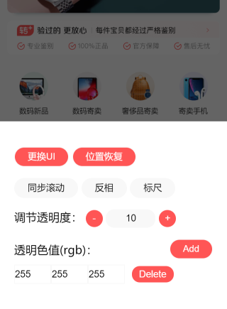

# uipx-webpack-plugin


  

UI图片对比插件，帮助开发者更方便地对比 UI 图与实现效果之间的差异



## Example

[live Demo](https://accforgit.github.io/uipx-webpack-plugin/index.html)

## 安装

```
npm install uipx-webpack-plugin -D
```

## Options

|key|Type|Description|Default|
|---|---|---|---|
|enable|boolean|是否开启，建议在测试环境中开启(`true`)，开发环境中关闭(`false`)|`true`|
|diffImg|string|需要用于对比的 UI原图，可以是 `http`链接也可以是 `base64`，如果是 `http`链接，则因为 `canvas` 的安全性要求，图片链接必须与当前页面同域，可以在这里配置，也可以后续通过插件面板从本地选取|-|
|opacityColorList|<span style="white-space: nowrap">number[][]</span>|需要将UI图中进行透明化的色值，例如 `[[255, 255, 255]]`，表示需要将 UI 图中 `rgb`值为 `[255, 255, 255]`的像素的透明度(`opacity`)置为 `0`，这是为了去除无关像素，减少视线干扰，可以在这里配置，也可以后续在插件面板中进行配置|-|

## 使用

`webpack.conf.js` 文件配置里增加以下插件配置即可

```js
// 引入插件
var UIPXPlugin = require('uipx-webpack-plugin'); 

module.exports = {
  ...

  plugins: [
    new UIPXPlugin({
      diffImg: 'http://example.com/example.png',
      opacityColorList: [
        [255, 255, 255]
      ],
      enable: true
    }),
    ...
  ]
  ...
}
```

`uipx` 作为一个调试模块，注定了需要在发布前把它去掉，为了避免人为操作失误而影响线上功能，这里建议配置如下：

`package.json` 文件配置：

```json
scripts: {
  "dev": "webpack -w --debug",
  "prod": "webpack -p"
}
```

`webpack.conf.js` 配置：

```js
// 引入插件
var UIPXPlugin = require('uipx-webpack-plugin'); 

// 接收运行参数
const argv = require('yargs')
  .describe('debug', 'debug 环境') // use 'webpack --debug'
  .argv;

module.exports = {
  ...

  plugins: [
    new UIPXPlugin({enable: !!argv.debug}),
    ...
  ]
  ...
}
```

这样，在开发的时候运行 `npm run dev`，发布的时候运行 `npm run prod` 即可。

`webpack-dev-server` 的配套用法：

用法其实跟上面一样，只是别忘记在启动脚本的时候增加 `--debug` 即可。如下：

```js
// package.json
"scripts": {
  ...
  "start:dev": "webpack-dev-server --debug",
  ...
},
```